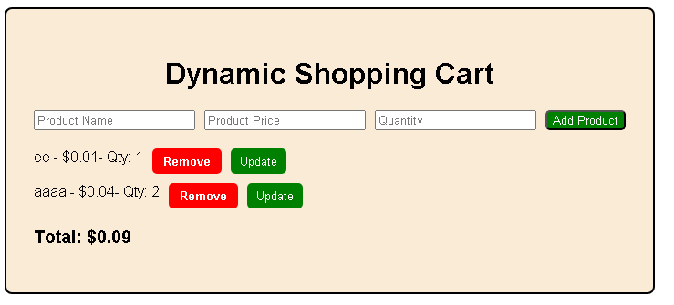

Dynamic Shopping Cart

A simple and interactive Shopping Cart Application built using HTML, CSS, and JavaScript.
This app allows users to add products with their price and quantity, update quantities, remove items, and view the total price dynamically.

Features

Add Product: Enter product name, price, and quantity to add an item to the cart.
Update Quantity: Modify the quantity of a specific item and automatically update the total price.
Remove Product: Delete individual products from the cart.
Real-Time Total: The total price updates automatically when items are added, updated, or removed.
Input Validation: Prevents adding empty fields or invalid numbers.

Chhallenges
The most challenging part was maintaining the real-time update of total price when products were removed or quantities changed.
Initially, deleted items reappeared due to a logic issue with the array update, which was fixed later.
I also focused on improving DOM manipulation efficiency by using document fragments and separate update functions.

App files

index.html: Main HTML file
style.css:  Minimal CSS
script.js: Core app logic
README.md

Reflection

How did you dynamically create and append new elements to the DOM?

I used JavaScript’s document.createElement() to create new list items (<li>) and buttons for Remove and Update.
Each time a user added a product, I created these elements dynamically, set their text content, and then appended them to the cart using appendChild().
To make this efficient, I used a document fragment in the displayCart() function so that multiple elements could be added to the DOM at once, reducing re-rendering.

What steps did you take to ensure accurate updates to the total price?

Whenever a product was added, updated, or removed, I recalculated the total using a separate function.
The total price was calculated by looping through the cart array and multiplying each product’s price × quantity, then updating the total display with textContent.
This made sure that the total always matched what was currently visible in the cart.

How did you handle invalid input for product name or price?

Before adding a product, I added input validation checks:
    The product name cannot be empty.
The price must be a positive number and can have at most two decimal places.
The quantity must be at least 1.
If any of these rules were broken, I used an alert() message to inform the user and stopped the function using return.

What challenges did you face when implementing the remove functionality?

The main challenge was keeping the cart array and total price in sync after an item was removed.
At first, removed items reappeared when I added new ones because the array wasn’t updated correctly.
I fixed it by finding the index of the item in the DOM, removing it from both the cart list in memory and the display, then recalculating the total price to reflect the change.